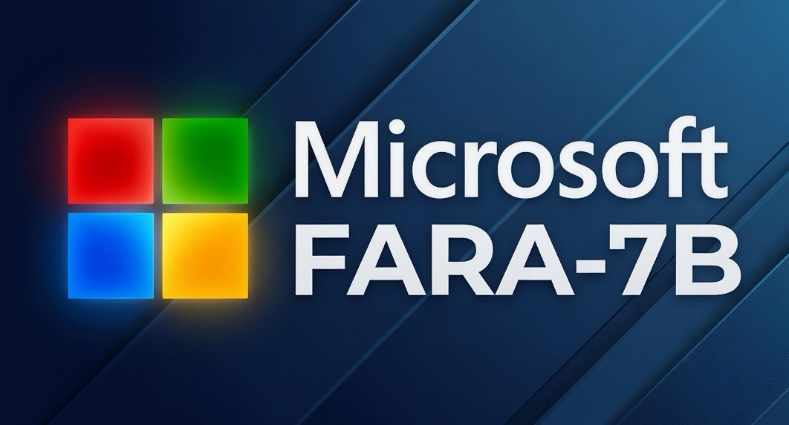
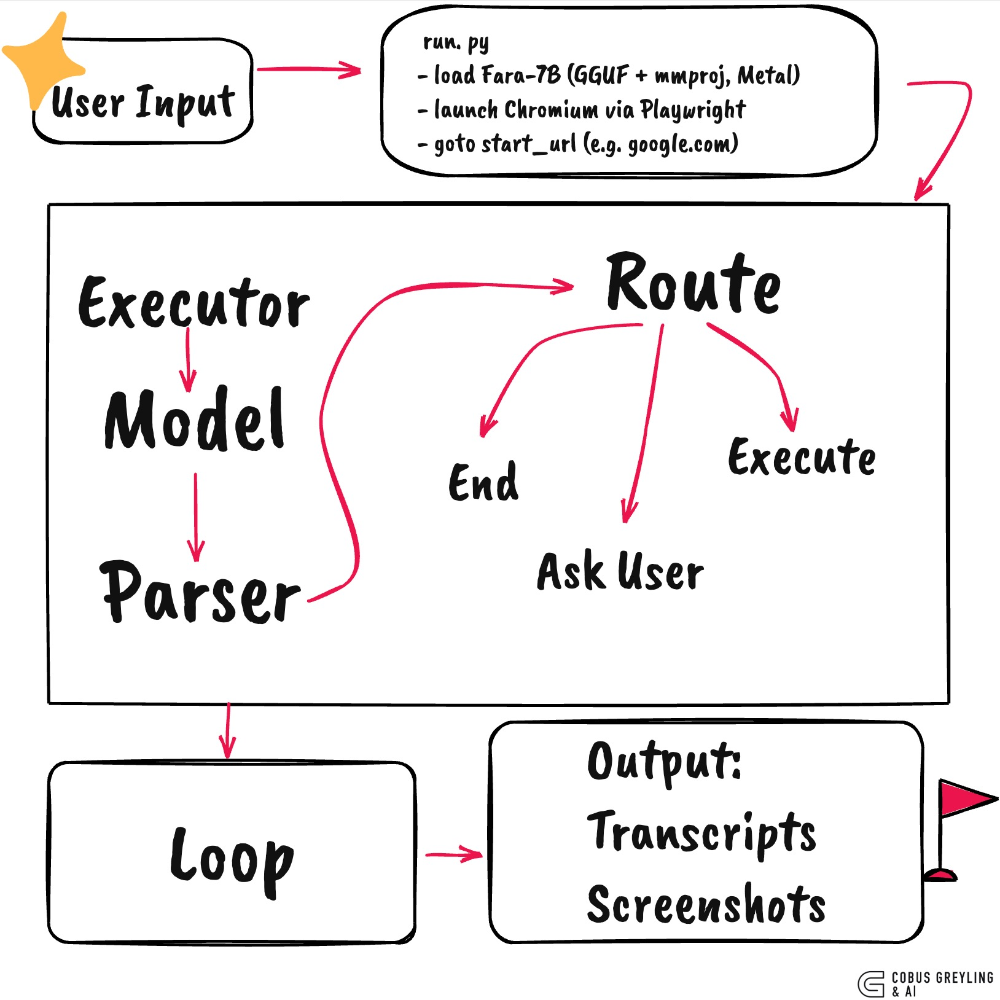

# fara-7b-agent

A minimal, fully-local agent harness for **Microsoft Fara-7B** — the 7-billion-parameter agentic small language model for computer use.

This repository runs Fara-7B on your laptop (Apple Silicon or CUDA), captures real browser screenshots, parses the model's thought + tool-call output, executes the action via Playwright, and loops. No cloud, no API keys, no telemetry.

## What is Fara-7B?

Fara-7B is Microsoft's open-weights agentic SLM released in November 2025. It is built on Qwen2.5-VL-7B and post-trained for web automation. Given a screenshot and a natural-language task, it emits a chain-of-thought reasoning trace followed by a structured `<tool_call>` describing the next action (click, type, scroll, visit_url, etc.).

The defining property: **the agent loop is baked into the weights**. The system prompt, action vocabulary, output format, and stop-at-critical-point behavior are all part of the model. The harness around it is small and dumb.

## Architecture



## What this repo gives you

- `fara/` — the harness package
  - `prompt.py` — the verbatim system prompt Fara was trained with
  - `model.py` — loads the GGUF and runs one inference turn
  - `parser.py` — extracts thought and tool_call from the model output, with normalisation for quantisation-induced name drift
  - `executor.py` — Playwright-backed dispatcher for Fara's action vocabulary
  - `agent.py` — the screenshot → infer → parse → execute → repeat loop
- `run.py` — CLI entry: `python run.py "your task"`
- `scripts/download_model.sh` — pulls the Q4_K_M quantisation and vision projector from Hugging Face
- `examples/` — recorded inference turns with screenshots and JSON transcripts (single-turn samples; longer runs land in `runs/` when you execute the harness)

## Hardware

- **Apple Silicon (M1/M2/M3)** with 16 GB RAM — runs Q4_K_M at usable speed via Metal
- **CUDA GPU** with 8 GB VRAM and up — faster, set `n_gpu_layers=-1` in `fara/model.py`
- ~6 GB free disk for the model files

## Quick start

```bash
# 1. install
pip install -r requirements.txt
playwright install chromium

# 2. download the model (~5.7 GB)
bash scripts/download_model.sh

# 3. run one task
python run.py "Find the Wikipedia article about Claude Shannon."
```

The harness opens a real Chromium window, navigates to a blank page (or one you specify), captures a screenshot, asks Fara what to do, executes the action, captures the next screenshot, and continues until the model emits `terminate` or hits a Critical Point.

## What Fara emits

On every turn the model returns a single assistant message structured as:

```
<free-text chain-of-thought explaining what to do next>

<tool_call>
{"name": "...", "arguments": {"action": "...", ...}}
</tool_call>
```

Action vocabulary (from the Fara-7B model card):

| Action | Purpose |
|---|---|
| `visit_url` | Navigate to a URL |
| `web_search` | Perform a web search |
| `left_click` | Click at a coordinate |
| `type` | Type text (at a coordinate or into a named input) |
| `key` | Press a key combination |
| `mouse_move` | Hover at a coordinate |
| `scroll` | Scroll the page |
| `history_back` | Navigate back |
| `pause_and_memorize_fact` | Record a fact for later use |
| `wait` | Wait for the page to settle |
| `terminate` | Task complete |

Quantised versions of Fara sometimes drift the wrapper name (emit `"name": "B"` instead of `"name": "computer_use"`); the parser in `fara/parser.py` dispatches on the `action` field, not the wrapper name, and normalises common aliases (`visit` → `visit_url`, `click` → `left_click`, `search` → `web_search`).

## Critical Points

Fara-7B was trained to **stop at Critical Points** — checkout, payment, send-email, place-call, sign-up, etc. When the model pauses, the harness surfaces the situation and waits for a human decision. This is enforced by the system prompt baked into the model.

## License

MIT. Copyright 2026 Cobus Greyling.

## Author

Cobus Greyling
